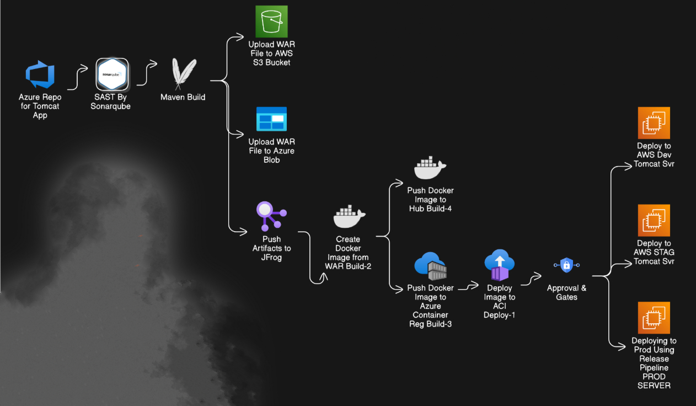

# Prod-SpringBoot-Pet-App 🚀  

# DevSecOps CI/CD Pipeline with Azure DevOps 🚀

This repository demonstrates a complete **CI/CD pipeline** implementation using **Azure DevOps**, covering phases from code integration to secure deployment, aligned with DevSecOps best practices.

---

## 🏗️ Application Architecture

## 📌 Project Goals

- Automate code build, test, and deployment pipelines.
- Perform **Static Application Security Testing (SAST)** and **Dynamic Application Security Testing (DAST)**.
- Integrate **SonarQube**, **JFrog Artifactory**, **Azure Blob Storage**, **Docker Hub**, and **Azure Container Registry (ACR)**.
- Deploy across multiple environments: **Staging**, **Production**, and **Azure Container Instance (ACI)**.

---

## 🔄 CI/CD Pipeline Overview

### 1. **Continuous Integration (CI)**

- ✅ Code Commit & Merge (GitHub → Azure Repos)
- ✅ **SAST** via SonarQube
- ✅ Build with Maven (skipping tests where needed)
- ✅ Docker image creation
- ✅ Artifact upload to:
  - Azure Blob Storage
  - AWS S3
  - JFrog Artifactory

### 2. **Continuous Delivery (CD)**

- ✅ Automated deployments to **Development** and **Staging**
- ✅ Manual approvals where required
- ✅ Integration testing environment readiness

### 3. **Continuous Deployment (CD)**

- ✅ Production push (manual approval step)
- ✅ Azure Container Instance (ACI) Deployment
- ✅ Verification via Route 53 subdomains (e.g., `staging.cloudvishwakarma.in`)

---

## 🔧 Tools & Technologies

| Purpose                | Tool/Service           |
|------------------------|------------------------|
| Version Control        | GitHub + Azure Repos   |
| CI/CD                  | Azure DevOps Pipelines |
| Build Tool             | Maven                  |
| Containerization       | Docker                 |
| Code Quality           | SonarQube              |
| Security Scanning      | Trivy, OWASP ZAP       |
| Artifact Repository    | JFrog + Azure Blob + AWS S3 |
| Cloud Platforms        | AWS + Azure            |
| DNS Routing            | AWS Route53            |

---

## 🗃️ Branching Strategy

- `main`: Production-ready code
- `dev`: Active development branch
- `feature/*`: Feature-specific development
- `hotfix/*`: Production hotfixes

---

## 🚀 Deployment Environments

| Environment | Platform   | IP/URL                            |
|-------------|------------|-----------------------------------|
| Staging     | AWS EC2    | `staging.cloudvishwakarma.in`     |
| Production  | AWS EC2    | `prod.cloudvishwakarma.in`        |
| ACI         | Azure ACI  | `http://<ACI-FQDN>:8080`          |

---

## ✅ Pipeline Execution Summary

- [x] Azure DevOps Agent Setup on Ubuntu VM (AWS)
- [x] Created and tested self-hosted agent pool
- [x] PAT generation and agent registration
- [x] CI: Build, Dockerize, and publish artifacts
- [x] CD: Deploy to multiple environments
- [x] SAST with SonarQube
- [x] DAST with ZAP scan
- [x] Trivy image vulnerability scanning
- [x] Multi-registry support: ACR + Docker Hub

---

## 📂 Folder Structure

## Understanding the Spring Petclinic application with a few diagrams

## 📸 Project Visuals

### 🔷 Azure Resource Visualizer for Pet Clinic App
Shows the high-level Azure architecture used to deploy the Spring Pet Clinic app.

---

### ✅ Jenkins Test Coverage
Illustrates test coverage for the application integrated with Jenkins CI/CD.

---

### 📁 Azure Resource Groups
Snapshot of logical groupings of Azure resources used in the project.

---

### 📱 Project Update (Optional)
A quick communication or observation related to deployment/CI in progress.

